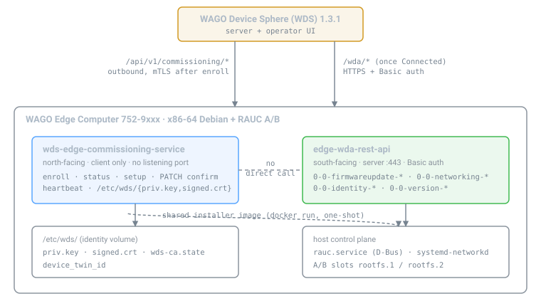

<h1 align="center"><code>wds-edge-commissioning-service</code> &harr; <code>edge-wda-rest-api</code></h1>

<p align="center">
The integration contract between the two device-side services that make a WAGO Edge Computer<br>
(752-9xxx, x86-64) behave like a PFC/CC inside WAGO Device Sphere.
</p>

<p align="center">


</p>

<p align="center"><b><a href="https://wagoalex.github.io/wds-edge-commissioning-service/">Read the formatted version &rarr;</a></b> &nbsp;·&nbsp; <a href="docs/index.html">docs/index.html</a></p>

<hr>

Each section covers one concern and one concern only; together they cover the whole seam.

## 01 &nbsp;The two components

Split by direction: one faces the server, one faces the device.

<table>
<tr><th></th><th>wds-edge-commissioning-service</th><th>edge-wda-rest-api</th></tr>
<tr><td><b>Faces</b></td><td>North - the WDS server</td><td>South - the device itself</td></tr>
<tr><td><b>Speaks</b></td><td>WAGO commissioning protocol <code>/api/v1/commissioning/*</code></td><td>WDA JSON:API <code>/wda/parameters/…</code>, <code>/wda/methods/…/runs</code></td></tr>
<tr><td><b>Direction</b></td><td>Outbound only, client-initiated, no listening port</td><td>Inbound only, HTTPS + Basic auth on :443</td></tr>
<tr><td><b>Owns</b></td><td>Identity, RSA-4096 key + CSR, signed cert, twin id, enrollment state, heartbeat</td><td>Device state: firmware slots, network, users, system info</td></tr>
<tr><td><b>Persists</b></td><td><code>/etc/wds/{priv.key,signed.crt,wds-ca.state}</code></td><td>Host config: systemd-networkd, RAUC A/B slots</td></tr>
<tr><td><b>Lifetime</b></td><td>One-shot onboarding, then a long-lived heartbeat</td><td>Long-lived service</td></tr>
<tr><td><b>Ships from</b></td><td>this repo</td><td><code>WagoAlex/edge-computer-fw-update</code>, <code>MODE=server</code></td></tr>
</table>

> [!IMPORTANT]
> **Boundary rule.** The commissioning service never calls the WDA REST API, and the WDA API never
> talks to the WDS server. They are coupled by a shared installer image, a shared parameter model and
> shared identity strings - not by a request between them. Everything that crosses the line crosses
> at one of the three points in section 03.

## 02 &nbsp;Runtime topology

<p align="center"></p>

Both services run as containers on the edge with `network_mode: host`. Once the device is
`Connected`, Device Sphere reaches the WDA API **directly** - the commissioning service is not in
that path.

## 03 &nbsp;Integration points

Exactly three. Nothing else crosses the boundary.

### 3.1 &nbsp;Firmware: one installer, two entry points

Both sides drive the **same** installer image, `wagoalex/wago-fw-update-edge-computer`. The coupling
is that image and its mount contract, not a REST call between the services.

<table>
<tr><th>Entry point</th><th>Driven by</th><th>Path</th></tr>
<tr><td><b>One-shot</b> <code>docker run</code>, <code>MODE=oneshot</code></td><td>commissioning service, when a setup bundle carries a <code>[Firmware]</code> section or <code>Workflow=firmwareupdate</code></td><td><code>agent/fwupdate.py</code> &rarr; container &rarr; host <code>rauc.service</code> over D-Bus. <b>No REST hop.</b></td></tr>
<tr><td><b>WDA method state machine</b>, <code>MODE=server</code></td><td>Device Sphere UI or any WDA client</td><td><code>POST /wda/methods/0-0-firmwareupdate-activate/runs</code> &rarr; <code>…-start/runs</code> &rarr; poll <code>0-0-firmwareupdate-status</code></td></tr>
</table>

```http
# the WDA path, as the UI drives it
POST /wda/methods/0-0-firmwareupdate-activate/runs   {"data":{"attributes":{"inArgs":{}}}}
POST /wda/methods/0-0-firmwareupdate-start/runs      {"data":{"attributes":{"inArgs":{}}}}
GET  /wda/parameters/0-0-firmwareupdate-status       # 0 idle … 4 Unconfirmed
GET  /wda/parameters/0-0-firmwareupdate-progress
GET  /wda/parameters/0-0-firmwareupdate-errorcause
# status 4: RAUC wrote the inactive slot. reboot activates; a bad boot falls back.
```

Both entry points end in the same place: RAUC writing the inactive A/B slot through the host
service. No RAUC logic lives in the commissioning service - it decides *when*, the installer decides
*how*.

> [!NOTE]
> **The trigger chain.** `Configuration/Device Sphere/Target Firmware` in the UI maps to
> `GET /api/v1/commissioning/setup?targetFirmware=<ver>`, which the commissioning service fetches
> over mTLS, verifies (CMS + sha256) and applies. That is where the one-shot entry point is invoked.

### 3.2 &nbsp;Device model: the WDA parameter tree

Device Sphere expects the PFC/CC tree. `edge-wda-rest-api` serves it; the commissioning service only
gets the device into a state where the server is allowed to call it.

| Device Sphere node | WDA parameter |
|---|---|
| `Configuration/Device Sphere/Target Firmware` | `0-0-firmwareupdate-*` (see 3.1) |
| `Network/Bridge/EthernetPort/*` | `0-0-networking-ethernetports[-N-current*]` |
| Hostname, domain | `0-0-networking-hostname-*`, `0-0-networking-domain-*` |
| Routing, DNS | `0-0-networking-routing-*`, `0-0-networking-dns-*` |
| Identity, version | `0-0-identity-*`, `0-0-version-*` |

> [!WARNING]
> **Two WDA servers exist on the edge. Do not confuse them.**
>
> | | `edge-wda-rest-api` | this repo's `wda.server` |
> |---|---|---|
> | Port | :443 (container :8443) | :8080 |
> | Auth | Basic, admin/wago | none |
> | Surface | full tree: firmware, networking, identity, users, system, presets | networking reads only, plus one writable method |
> | Adds | - | `POST /wda/methods/0-0-networking-configure/runs` |

The writable configure method this repo contributes is **not** part of `edge-wda-rest-api` -
requesting it there returns 404 (verified, section 07). It runs on the commissioning container's own
:8080 surface:

```http
POST :8080/wda/methods/0-0-networking-configure/runs
{"port": 1, "ip": "192.168.2.17", "prefix": 24, "gateway": "192.168.2.1"}
# accepts the flat body above or a JSON:API envelope with "inArguments".
# writes a systemd-networkd drop-in; live `ip` apply as fallback.
```

The envelope key differs between the two: `edge-wda-rest-api` reads `data.attributes.inArgs`; this
repo's server reads `data.attributes.inArguments` or a flat object.

### 3.3 &nbsp;Identity consistency

Values presented at enrollment must equal the values the WDA API reports, or Device Sphere shows a
twin that disagrees with the device's own API.

| Enrollment field (`deviceIdentInfos`) | Source | Must match WDA parameter |
|---|---|---|
| `orderNumber` | `WDS_ORDER_NUMBER` | `0-0-identity-ordernumber` |
| `firmwareVersion` | `/etc/REVISIONS` | `0-0-version-firmwareversion` |
| `uii` | type label / `WDS_UII` | `0-0-identity-serialnumber` |
| `hostname` | `gethostname(2)` | `0-0-networking-hostname-currentname` |
| `macAdress` (sic, one d) | `SIOCGIFHWADDR` | `0-0-networking-ethernetports-N-currentMacAddress` |

Set both sides from the same values: `WDS_ORDER_NUMBER` / `ORDER_NUMBER`,
`WDS_FIRMWARE_VERSION` / `FIRMWARE_VERSION`.

## 04 &nbsp;End-to-end sequence

```
1  discovery    GET   /api/v1                          -> {"name":"wds"}            [commissioning]
2  enroll       POST  /api/v1/commissioning/enroll      -> 201 deviceTwinId          [commissioning]
3  accept       operator accepts in the Device Sphere UI                             [operator]
4  poll         POST  /api/v1/commissioning/status      -> Prepared + signed cert    [commissioning]
5  bundle       GET   /api/v1/commissioning/setup       -> appload, mTLS             [commissioning]
6  firmware     bundle [Firmware] -> docker run installer, one-shot -> RAUC          [installer]
7  confirm      PATCH /api/v1/commissioning/confirm     -> 200, twin Connected       [commissioning]
8  heartbeat    every 30s, answers delete-confirmation                               [commissioning]
9  managed      Device Sphere reads/writes /wda/* directly                           [WDA API]
```

Steps 1-5, 7, 8 are the commissioning service. Step 6 is the shared installer. Step 9 is the WDA API.
Step 3 is a human. Nothing else exists in this flow.

> [!CAUTION]
> **Two non-obvious requirements**, both established against a real WDS 1.3.1 server:
> - `confirm` must be **PATCH** with `Content-Type: application/json`. POST, or `text/json`, returns
>   HTTP 403. This matches WAGO's own `wds-device-agent`.
> - The server's **accept resolves the device by item number**. A genuine edge item (`0752-9401`)
>   returns `accept: Not Found`; a recognized controller item (`0750-8302`) succeeds. See section 08.

## 05 &nbsp;Deployment

```yaml
services:
  commissioning:
    image: wago-edge-commissioning:latest
    network_mode: host
    environment:
      MODE: both                     # onboard | wda | fwupdate | both
      WDS_SERVERS: https://wdsserver:443
      WDS_MODE: unsecure             # TOFU the server cert
      WDS_ORDER_NUMBER: "0750-8302"  # see section 08
      FW_UPDATE_IMAGE: wagoalex/wago-fw-update-edge-computer:bundle-latest
      FW_DRY_RUN: "false"
      WDA_PORT: "8080"               # this repo's networking surface
    volumes:
      - wds-identity:/etc/wds
      - /var/run/docker.sock:/var/run/docker.sock   # to launch the installer

  wda:
    image: wagoalex/wago-fw-update-edge-computer:bundle-latest
    restart: unless-stopped
    environment:
      MODE: server
      WDA_PASSWORD: "..."
      ORDER_NUMBER: "0752-9xxx"
      FIRMWARE_VERSION: "04.09.01(31)"
    ports: ["443:8443"]
    volumes:
      - /run/dbus/system_bus_socket:/run/dbus/system_bus_socket
      - /etc/rauc/keyring.pem:/etc/rauc/keyring.pem:ro
      - /docker/rauc-stage:/docker/rauc-stage

volumes: { wds-identity: {} }
```

Required of the host, once: a RAUC keyring that trusts the bundle signature, and the `loop` +
`dm-verity` modules loaded. See `edge-computer-fw-update`.

## 06 &nbsp;Configuration ownership

Every setting belongs to exactly one side.

| Concern | Owner | Where |
|---|---|---|
| Server discovery, TLS mode, poll rate, timeout | commissioning | `/etc/wds/wds.cfg`, `WDS_*` env |
| Device key, CSR, signed cert, twin id, state | commissioning | `/etc/wds/` volume |
| Which firmware version to install | commissioning, from the server | `?targetFirmware=` |
| How firmware installs, slot choice, rollback | installer / WDA API | RAUC over host D-Bus |
| Network interface config | WDA API (reads), this repo's :8080 (writes) | systemd-networkd drop-ins |
| API auth | WDA API | `WDA_PASSWORD` |
| Reported identity strings | both, must agree | section 3.3 |

## 07 &nbsp;Verification

Run against the live lab: edge `192.168.2.17`, WDS server `192.168.2.199`. Every row below was
executed, not assumed.

| Check | Result |
|---|---|
| `GET https://192.168.2.199/api/v1` | **pass** - `{"name":"wds","assemblyVersion":"1.3.1.0"}` |
| `GET https://192.168.2.17/wda` (admin/wago) | **pass** - 200, `orderNumber 0752-9xxx`, `firmwareVersion 04.01.00`, `meta.version 1.5.2-compat` |
| `0-0-firmwareupdate-{status,progress,revertable}` | **pass** - 200; status `0` (idle) |
| `0-0-identity-{ordernumber,serialnumber}`, `0-0-version-firmwareversion` | **pass** - 200 |
| `0-0-networking-{ethernetports,hostname-currentname,routing-currentroutes}` | **pass** - 200; 2 EthernetPort instantiations |
| Method contract: `POST /wda/methods/0-0-firmwareupdate-getlastlogentries/runs` | **pass** - 201, `executionStatus: done`, `outArgs.Entries` |
| Control: `POST /wda/methods/0-0-does-not-exist/runs` | **pass** - 404, so the 201 above is real routing |
| `GET /wda/parameters/0-0-networking-configure` on :443 | **404 by design** - confirms it lives on this repo's :8080 surface, not on `edge-wda-rest-api` |
| Repo test suite, `pytest tests/` | **pass** - 7/7 |

Not re-run here, because it flashes a slot or needs an operator: the full enroll -> accept ->
confirm handshake, and `0-0-firmwareupdate-activate`/`-start`. Both were previously taken to
`Connected` and to RAUC status 4 on this same hardware.

## 08 &nbsp;Known limits

| Limit | Owner | Status |
|---|---|---|
| `commissioning/accept` returns 404 for genuine edge items `0752-9xxx`; succeeds for a known controller item `0750-8302` | WDS server (WAGO) | Workaround: `WDS_ORDER_NUMBER=0750-8302`. Real fix is server-side catalog registration of the edge item, mapped to a Docker-mode profile. |
| No amd64 build of WAGO's `wds-device-agent`; the registry ships `ptxdist-*` arm/arm64 only | WAGO registry | This repo substitutes an x86 `device_agent.py`; an amd64 image equivalent was built. |
| ARM `.ipk` in the setup bundle cannot be applied on x86 | bundle format | Skipped deliberately; the x86 agent runs in its place. |
| Firmware activation needs a reboot | operator | RAUC writes the inactive slot; reboot activates, a bad boot auto-falls-back. |
| The commissioning service's own WDA surface is networking-only and unauthenticated | this repo | Intended for host-local use; do not expose it off-device. |

## 09 &nbsp;Out of scope

- RAUC bundle building and signing - `WagoAlex/edge-computer-fw-update`.
- The WDS server itself, its device catalog, and pairing mode - WAGO product.
- CODESYS, BACnet, and the rest of the PFC application stack.
- Any inbound path into the commissioning service; it has no listening port.
